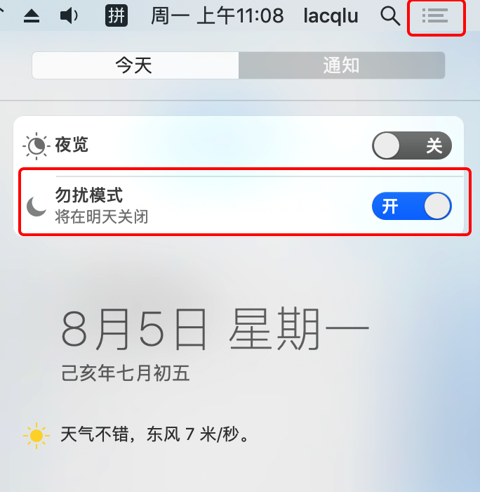
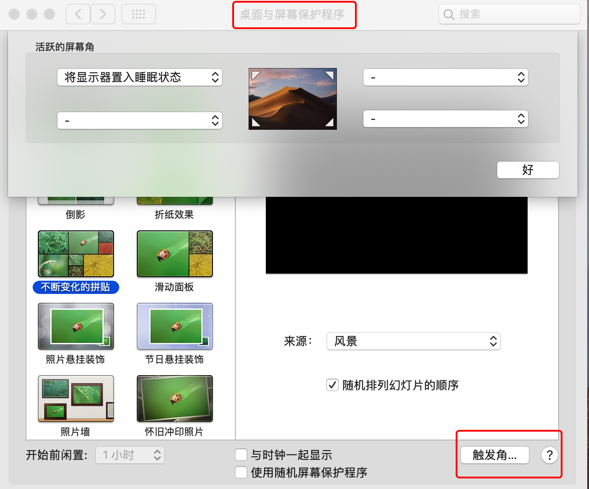
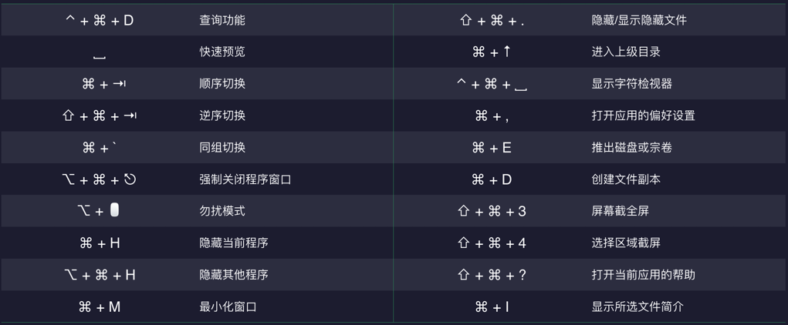

# 13 个 macOS 技巧

> 文中用到的符号说明：
>
> ⇧  `shift`
>
> ⌘  `command`
>
> ⌃   `control`
>
> ⌥  `option`
>
> ␣   `space 空格` 
>
> ⎋  `esc`
>
> ⇥  `tab`
>
> 🖱 `鼠标点击`


### 1. Siri 发来贺电

打开终端输入，带给你不一样的惊喜：

```bash
say 我已关注【布谷工作室】啦，你还在等什么呢
```


### 2. 查询功能

1. **法 1**：笔记本可以打开偏好设置找到触控板，开启查询功能，然后三指轻点。
2. **法 2**：指向要查询的词， `⌃ + ⌘ + D`。


### 3. 快速预览

选中文件按下空格，`␣`。


### 4. 程序切换

多个程序切换可以用以下快捷键：

顺序切换，`⌘ + ⇥`。

逆序切换，`⇧ + ⌘ + ⇥`。

同组切换，`⌘ + · `，`·` 一般在键盘右上角。


### 5. 强制关闭程序

1. 打开活动监视器找到相应进程关闭。
2. 通过 `⌥ + ⌘ + ⎋` 打开强制退出应用小窗口关闭。


### 6. 勿扰模式

右上角任务中心勿扰，通过 `⌥ + 🖱` 快捷操作。



### 7. 隐藏程序

隐藏或者最小化窗口。

隐藏当前，`⌘ + H`。

隐藏其他，`⌥ + ⌘ + H`。

最小化窗口，`⌘ + M`，一般不太推荐使用这个，因为要点击才能再次出现。


### 8. 触发角

鼠标移到角落触发特定任务。




#### 9. 多桌面模式

并发任务可开多个桌面。按下 `F3` 可设置多个桌面。


### 10. 显示隐藏文件

macOS 中在文件名前加点的都是隐藏文件，一般不显示，可以通过 `⇧ + ⌘ + .` 来控制显示或隐藏。


### 11. 进入上级目录

进入文件的父目录可以用 `⌘ + ↑` 快捷键。


### 12. 截图命令

屏幕截全屏，`⇧ + ⌘ + 3`。

选择区域截屏，`⇧ + ⌘ + 4`。


### 13. 复制文件名

通过按住 `⇧` 或者 `⌘` 选中要复制文件，`⌘ + C` 即可复制选中文件名。


### 常用快捷键速查表




### 快速记忆

**新人小布谷的幸福生活**

刚加入工作室的小布谷第一次听说了 Bugu 却不知道是什么意思，打开电脑，对着单词**三指轻拍** [2]，轻松查到，**按下空格** [3] 浏览了一遍设计组规范，便开启了忙碌的一天。不知不觉打开了好多应用，小布谷灵机一动，按下了 `⌘ + ⇥` [4] 快捷地切换。


呀！QQ 音乐怎么没响应了，按下 `⌥ + ⌘ + ⎋` [5] 打开小窗口强制关闭它。好多人找又有实验报告怎么办，鼠标移到右上角任务中心，开个**勿扰模式** [6]，还要按下 ⌘ + H  [7] 隐藏不必要的窗口，这下世界清净了。很快到了吃饭时间，**鼠标移到左上角** [8] 让电脑休眠先。


休息好了就该处理多任务了，**开多个窗口** [9] 自如切换，要改下这个隐藏的配置文件，`⇧ + ⌘ + .` [10]，哪里藏，还不快现形。要看这个文件的上级目录怎么办，`⌘ + ↑ `[11]，旁边网管组小哥哥的声音很合时宜的响起。


活干完了，要截图发组长，`⇧ + ⌘ + 3` [12] 先截个全屏，再用 `⇧ + ⌘ + 4` 截取一部分，最后**拷贝目录** [13] 写个日志回家，完美的一天。

