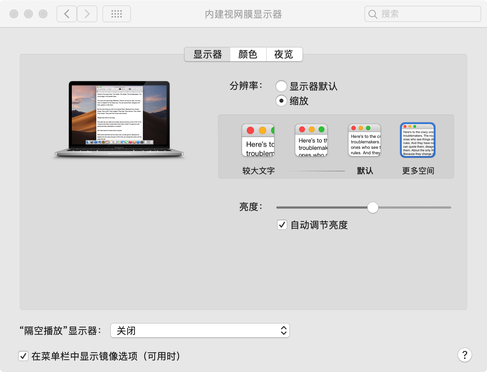

# macOS 系统调教日志

用久了的 macOS 系统还是会出现各种各样的小问题，为此，备份了必要文件，开启了系统重装之旅。

macOS 系统重装很简单，重启系统过程中长按 `Option-Command-R` 直到旋转地球出现，即可开始重装。


重装后分以下几步配置系统，打造舒适的办公开发环境。由于本文是基于个人习惯配置的环境，全程遵循唯一的准则——**懒**，故可能只符合部分人使用习惯。


### 1. 系统配置篇

**1.1 触控板**

触控板，三步搞定，选中所有能选的，调整跟踪速度为最快，将图中【光标与点按】下的查询与数据检测器触发方式改为**三指轻点**。更多，更快，更轻，懒字无疑。


关于触控板，还有一条值得解锁的隐藏技能，开启触控板的【三指拖移】功能。打开系统偏好设置，找到辅助功能，按下图指示即可开启。


**1.2 显示器**

简单两步，分辨率改成缩放，选择更多空间（本身分辨率较高的有钱人请忽略）。更多内容，降低切屏成本。




**1.3 聚焦（Spotlight）**

右上角被圈起来的家伙，是咱懒人一族最好的伙伴，可以帮助我们快速找到电脑上的内容，他还有个孪生哥哥叫 **Alfred**，比他功能更多点，基础版免费，推荐使用。请记住他们的口号，**凡是能用键盘解决的问题，最终都会用键盘解决**。


除此之外，键盘，程序坞，保护程序等等都可以做一些调整来增加操作的舒适度。


### 2. 终端配置篇

macOS 基于类 unix 内核，终端体验极佳，深得开发喜爱。下面列举了一些常用的配置。


**2.1 Homebrew：macOS 上的包管理工具**

Homebrew，是 macOS 上的包管理工具，包含了大多数常用的应用。

```bash
# 安装 Homebrew，安装过程中可能会提醒你安装 Xcode Command Line Tools
/usr/bin/ruby -e "$(curl -fsSL https://raw.githubusercontent.com/Homebrew/install/master/install)"
```

Homebrew 的妙用在接下即可见到。 直接在终端输入 `brew` 或者 `brew cask` 回车便会看到常用命令提示，这也是大多命令的风格。

```bash
# brew 从源码下载解压然后 ./configure && make install
brew install/uninstall/upgrade # 安装/卸载/更新应用
brew update/search/list/doctor # 更新/搜索/列表/诊断

# brew cask 是安装已经编译好了的应用包 （.dmg/.pkg）
brew cask install/uninstall/reinstall # 安装/卸载/重装
brew cask upgrade/list # 更新应用/列表
```


**2.2 iTerm2：替代系统终端 Terminal**

直接去 [iTerm2 官网](https://www.iterm2.com/index.html) 下载安装即可，或者用 Homebrew 安装。

```bash
# 用 Homebrew 安装 iterm2
brew cask install iterm2
```

推荐配置个快捷键来显示和隐藏 iTerm2，如下图。


**2.3 zsh + Oh My Zsh：终极 shell**

```bash
# 使用 Homebrew 安装 zsh
brew install zsh zsh-completions

# 安装 Oh My Zsh 拓展 zsh 功能
curl -L https://github.com/robbyrussell/oh-my-zsh/raw/master/tools/install.sh | sh

# 用文本编辑器打开 ～/.zshrc 找到 plugins() 函数并配置常用插件
plugins=(git colored-man colorize z pip python brew osx)
```


**2.4 SpaceVim：懒人 vim 配置**

想用好看的 vim 又懒得折腾的伙伴，用它准没错。

```bash
# 安装 SpaceVim，安装成功后，初次打开 Vim 或者 gVim 时，SpaceVim 会自动下载并安装插件。
curl -sLf https://spacevim.org/cn/install.sh | bash
```


**2.5 nvm：node 版本控制工具**

使用 nvm 可以管理不同的 node 版本。

```bash
# 如果之前有装 node，可先卸载
brew remove node
sudo rm -rf /usr/local/{bin/{node,npm},lib/node_modules/npm,lib/node,share/man/*/node.*}

# 用 Homebrew 安装 nvm
brew install nvm

# 安装完成后用文本编辑器打开 ～/.zshrc 或其他终端加入下面这段
export NVM_DIR="$HOME/.nvm"
  [ -s "/usr/local/opt/nvm/nvm.sh" ] && . "/usr/local/opt/nvm/nvm.sh"  # This loads nvm
  [ -s "/usr/local/opt/nvm/etc/bash_completion" ] && . "/usr/local/opt/nvm/etc/bash_completion"  # This loads nvm bash_completion

# 让命令生效
source ~/.zshrc

# nvm 安装 node
nvm install v10.16.0/v8.16.0 # 安装 node 10/node 8
nvm use 8 # 使用 node 8
```


### 3. 应用配置篇

安装应用时，一定要克制，只需要时刻记得一句话，**请问，您是什么垃圾？**，便不会陷入无法抉择的漩涡之中。这里列举了我安装的应用。


同样也可以用 Homebrew 来安装，不过大型应用还是推荐手动下载安装。

```bash
# 用 Homebrew 安装常用应用
brew install yarn nvm http-server # 安装终端用到的应用

brew cask install visual-studio-code google-chrome iterm2 tencent-lemon typora alfred wechat qq qqmusic go2shell moom baidunetdisk # 安装打包好的图形界面应用

# 搜索支持的应用
brew search qq # 搜索带 qq 的名字
```


### 4. 常用工具命令篇

**4.1 重建索引**

```bash
# 开启搜索功能
sudo mdutil -a -i on
```


**4.2 不明开发者**

```bash
# 方法一：按住 Control 后，再次点击软件图标。改变【系统偏好设置】中的安全性与隐私安装方式为允许任何来源；
# 方法二：终端输入
sudo spctl --master-disable
```


**4.3 启动台（LaunchPad）图标大小调整**

```bash
# 调整每列图标数为 8
# 调整每行图标数为 7
# 重置启动台 && 重启启动台
defaults write com.apple.dock springboard-columns -int 8
defaults write com.apple.dock springboard-rows -int 7
defaults write com.apple.dock ResetLaunchPad -bool TRUE && killall Dock

```


**4.4 突然没声音了**

```bash
# 关闭 coreaudiod 进程，然后它会自动重启
sudo killall coreaudiod
```


macOS 系统调教之路漫漫而无涯，探索，在路上。

